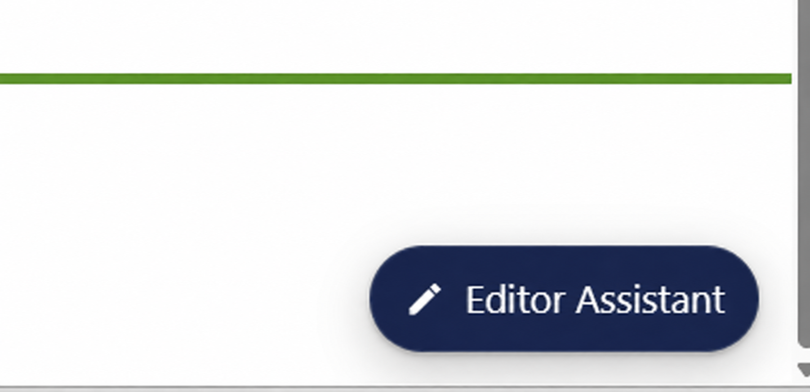

# Umbraco Editor Assistant


Umbraco Editor Assistant adds a small **Editor Assistant** button to each published page on your website. When a logged-in backoffice user clicks the button, the corresponding content item opens directly in the Umbraco backoffice, ready to edit.

The package is built for **Umbraco 17** and **.NET 10** and is distributed as a Razor Class Library. It requires no template changes in a standard Umbraco installation.

## Frontend button

Authenticated backoffice users see the Editor Assistant button on the frontend:



## Why use this package?

Content editors often notice a change while looking at the live website, but finding the same page in a large backoffice content tree takes time. Editor Assistant removes that friction by connecting the published page directly to its editing workspace.

- **Edit the page you are viewing** — one click opens the matching Umbraco document.
- **No template integration** — markup and styles are added automatically.
- **Invisible to visitors** — only authenticated backoffice users receive the button.
- **Virtual-directory support** — generated URLs respect the application's `PathBase`.
- **Safe caching defaults** — editor-specific responses are private and non-cacheable by default.
- **Accessible interaction** — keyboard focus, high-contrast text, reduced motion, and a new-tab announcement are included.
- **Theme-friendly styling** — host and Umbraco UI custom properties are used when available.

## Requirements

- Umbraco CMS 17
- .NET 10
- A frontend layout with standard `<head>` and `<body>` elements
- Built-in MVC tag helpers enabled, as in standard Umbraco templates

```cshtml
@addTagHelper *, Microsoft.AspNetCore.Mvc.TagHelpers
```

## Installation

Install the package in the Umbraco web project:

```shell
dotnet add package Umbraco.EditorAssistant
```

Restart the application. No stylesheet references, layout markup, `_ViewImports.cshtml` entries, or service registrations are normally required.

## How it works

The package registers an Umbraco composer and an ASP.NET Core Tag Helper Component. On frontend requests, it:

1. Adds the package stylesheet to the end of `<head>`.
2. Gets the current published content from the Umbraco request.
3. Checks the user against Umbraco's backoffice authentication scheme.
4. Builds an edit URL from the content key.
5. Adds the Editor Assistant link to the end of `<body>` only when the user is authenticated and valid published content is available.

The edit workspace opens in a new tab, leaving the frontend page available for review. Umbraco remains responsible for enforcing the user's content permissions at the destination.

The button is not rendered when:

- The visitor is not authenticated in the Umbraco backoffice.
- The request does not resolve to published content.
- The current content has no valid key.
- An Umbraco context is unavailable.

## Configuration

The defaults suit a standard installation. Add an `EditorAssistant` section to `appsettings.json` only when they need to change:

```json
{
  "EditorAssistant": {
    "BackofficePath": "/umbraco",
    "DisableResponseCaching": true
  }
}
```

| Setting | Default | Description |
| --- | --- | --- |
| `BackofficePath` | `/umbraco` | Backoffice location. It must begin with `/`; a trailing slash is removed automatically. |
| `DisableResponseCaching` | `true` | Adds private, no-store response headers when the component is processed, preventing editor-only markup from entering a shared cache. |

Custom backoffice path example:

```json
{
  "EditorAssistant": {
    "BackofficePath": "/management"
  }
}
```

### Caching guidance

Keep `DisableResponseCaching` enabled unless the component is rendered through an authenticated fragment cached independently from the public page. Because the button depends on authentication state, full-page caching can expose editor markup to visitors or hide it from editors.

## Styling and theming

The stylesheet is served from:

```text
/App_Plugins/EditorAssistant.Umbraco/css/editor-assistant.css
```

The component checks host button tokens, then Umbraco UI tokens, and finally built-in fallbacks. Customize it from site CSS without replacing the package stylesheet:

```css
.editor-assistant {
    --button-background: #1b264f;
    --button-hover-background: #26366f;
    --button-text-color: #fff;
    --button-focus-color: #00bec1;
    --button-font-family: inherit;
    --button-font-size: 1rem;
    --button-font-weight: 600;
}
```

Available CSS hooks:

- `.editor-assistant` — link/button container
- `.editor-assistant__icon` — pencil icon
- `.editor-assistant__label` — button text

At viewport widths up to `30rem`, the visible label is hidden and the compact icon remains. Its accessible name is preserved for assistive technology.

## Accessibility and interaction

- The link's accessible name contains the current content name.
- Assistive technology is told that the link opens a new tab.
- The decorative icon is excluded from the accessibility tree.
- Text uses the primary contrast token with a white fallback.
- Keyboard focus has a visible outline.
- The icon animates only on hover or keyboard focus.
- Motion is disabled when `prefers-reduced-motion: reduce` is active.
- The component is omitted from printed pages.

## Security notes

- The button is conditional UI, not an authorization boundary; Umbraco validates backoffice permissions.
- Dynamic values are HTML encoded before markup is appended.
- The new-tab link uses `noopener` and `noreferrer` so the opened page cannot control the source window.
- `nofollow` asks search engines not to follow the backoffice URL.
- Response caching is disabled by default to protect authentication-dependent output.

## Manual rendering

An `EditorAssistantViewComponent` is included for applications that need explicit rendering:

```cshtml
@await Component.InvokeAsync("EditorAssistant")
```

Standard installations should use automatic rendering. Calling the View Component while the automatic Tag Helper Component is active can render the button twice.

## Project structure

```text
src/
└── Umbraco.EditorAssistant/
    ├── Components/     Automatic Tag Helper and optional View Component
    ├── Composers/      Umbraco and dependency-injection registration
    ├── Models/         Options and view model
    ├── Services/       Authentication check and edit-URL generation
    ├── Views/          View Component markup
    └── wwwroot/        Package manifest and stylesheet
tests/
└── Umbraco.EditorAssistant.Tests/
    └── Services/       Unit tests for editor-link generation
```

## Build and package locally

From the repository root:

```shell
dotnet restore "Umbraco EditorAssistant.slnx"
dotnet build "Umbraco EditorAssistant.slnx" --configuration Release
dotnet pack "src/Umbraco.EditorAssistant/Umbraco.EditorAssistant.csproj" --configuration Release
```

The NuGet package is written to `src/Umbraco.EditorAssistant/bin/Release` unless another output directory is specified.

Run the automated tests from the repository root:

```shell
dotnet test "Umbraco EditorAssistant.slnx" --configuration Release
```

The service tests cover authentication gating, missing and invalid content, edit URL generation, application path bases, custom backoffice paths, fallback configuration, cancellation, and argument validation. Before release, also verify in an Umbraco 17 site that:

- Anonymous visitors do not see the button.
- Authenticated users see it on published content pages.
- It opens the correct content workspace in a new tab.
- Custom backoffice paths and application path bases generate correct URLs.
- Keyboard focus, mobile layout, and reduced-motion behavior work as expected.

## Contributing

Issues and pull requests are welcome. Keep changes focused, preserve authentication and cache-safety behavior, and include clear verification steps. Update this README when documented behavior changes; it is also embedded in the NuGet package.

## License

No license file is currently included. Add a license before redistribution or accepting external contributions.
